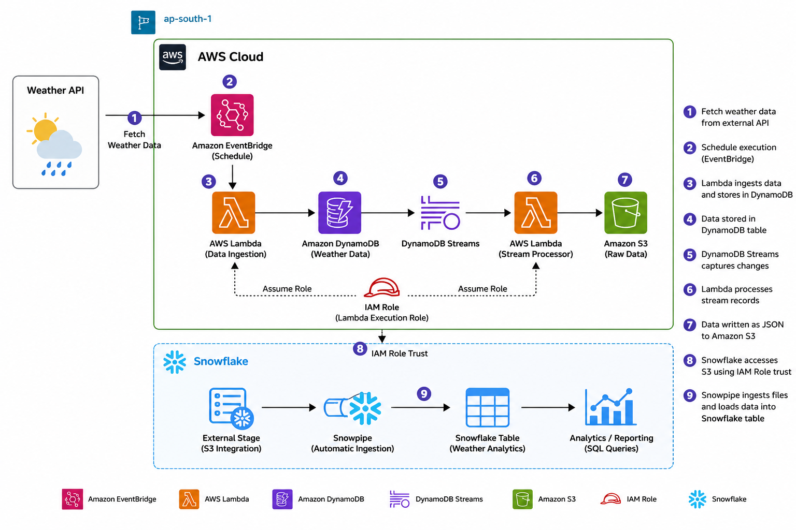
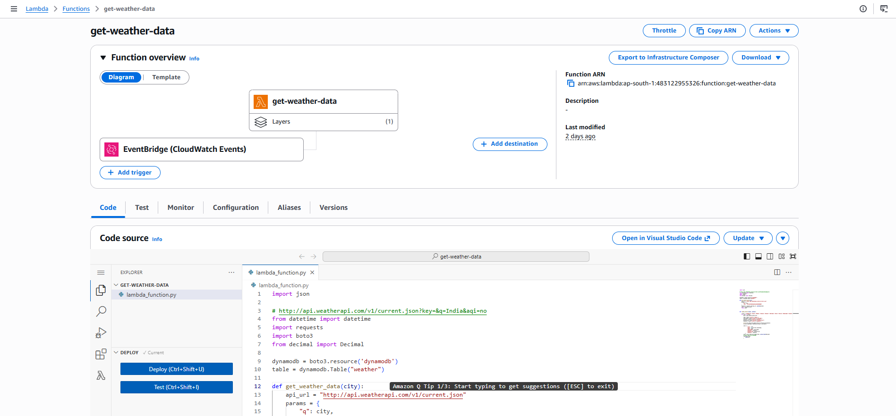
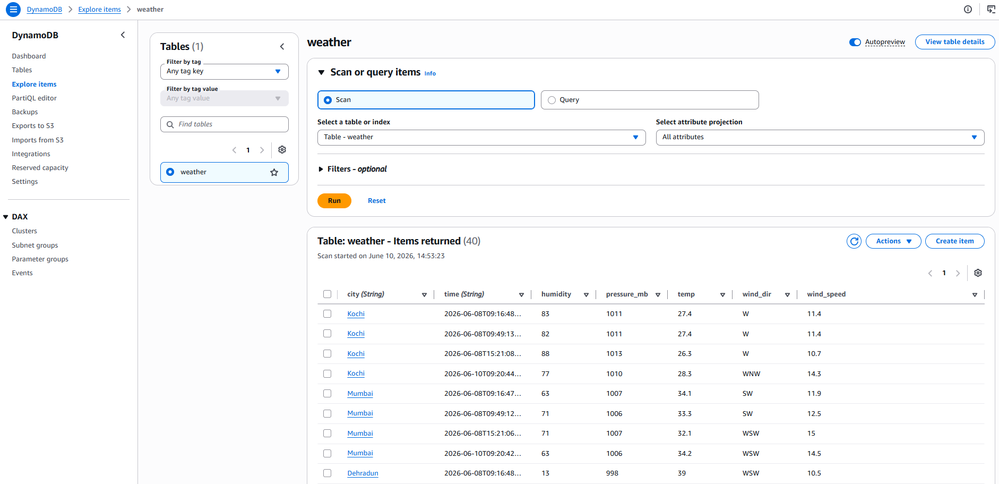
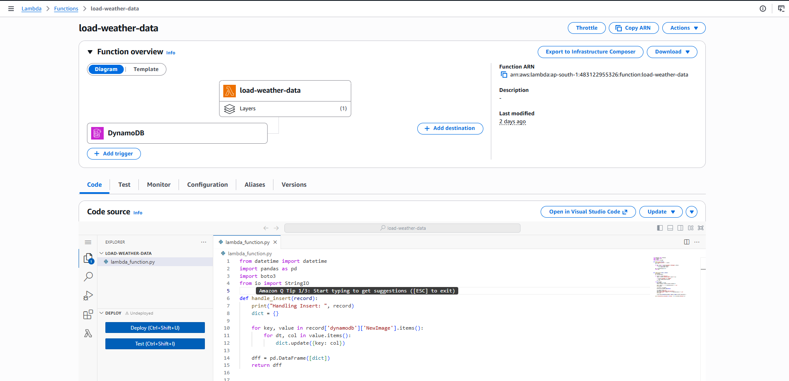
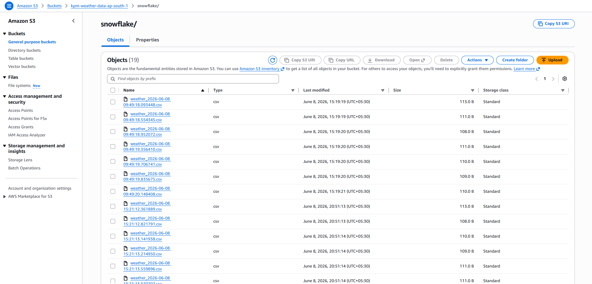
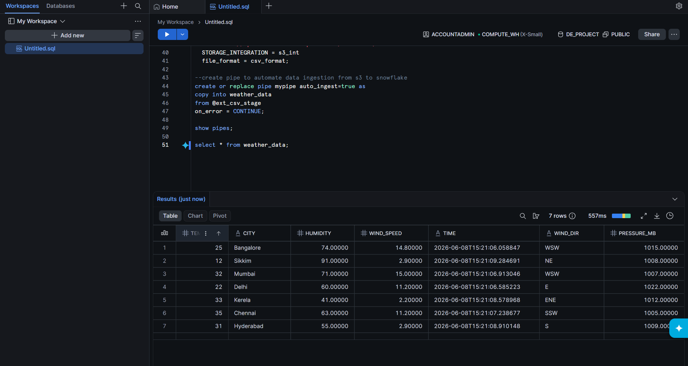

# 🌦️ Weather Data Pipeline using AWS & Snowflake

## 📌 Project Overview

This project demonstrates an end-to-end serverless data engineering pipeline that ingests weather data from an external Weather API and loads it into Snowflake for analytics.

The solution leverages AWS Lambda, DynamoDB, DynamoDB Streams, Amazon S3, and Snowflake Snowpipe to create a fully automated near real-time data pipeline.

---

## 🏗️ Architecture

<p align="center">
  
</p>

---

## 🔄 Data Flow

1. AWS Lambda fetches weather data from an external Weather API.
2. The response is stored in Amazon DynamoDB.
3. DynamoDB Streams capture new inserts automatically.
4. A second Lambda function is triggered by DynamoDB Streams.
5. The second Lambda writes the records to Amazon S3.
6. Snowpipe continuously monitors S3 for new files.
7. Snowflake automatically loads incoming data into analytics tables.
8. Data becomes available for reporting and analysis.

---

## 🛠️ Technologies Used

| Service | Purpose |
|----------|----------|
| AWS Lambda | Serverless compute |
| DynamoDB | Operational data storage |
| DynamoDB Streams | Event-driven change capture |
| Amazon S3 | Data lake storage |
| Snowflake | Cloud data warehouse |
| Snowpipe | Automated ingestion |
| Python | Data processing |
| Weather API | Source system |

---

## 📂 Repository Structure

```text
weather-data-pipeline/
│
├── architecture/
│   └── Weather_data_architecture-diagram.png
│
├── lambda/
│   ├── weather_ingestion/
│   └── dynamoDB_to_s3/
│
├── snowflake/
│   └── Snowflake_code.sql
│
├── screenshots/
│   ├── get-weather-data-screenshot.png
│   ├── dynamoDB-screenshot.png
│   ├── load-weather-data-screenshot.png
│   ├── s3-screenshot.png
│   └── Snowflake_data_load.png
│
└── README.md
```

---

## ⚙️ AWS Components

### Lambda 1 - Weather Data Ingestion

Responsibilities:

- Call Weather API
- Parse API response
- Insert weather records into DynamoDB
- Execute on scheduled intervals

---

### DynamoDB

Responsibilities:

- Store incoming weather records
- Serve as operational datastore
- Trigger DynamoDB Streams on inserts

---

### Lambda 2 - DynamoDB to S3

Responsibilities:

- Process DynamoDB Stream events
- Transform records
- Write JSON files into Amazon S3

---

### Snowpipe

Responsibilities:

- Monitor S3 bucket
- Detect new files
- Automatically load data into Snowflake tables

---

## 📸 Solution Screenshots

### Weather Data Ingestion Lambda



---

### DynamoDB Records



---

### DynamoDB Stream Processing Lambda



---

### S3 Data Lake Storage



---

### Snowflake Data Load



---

## 🧾 Snowflake Objects

This repository contains Snowflake SQL scripts used to create:

- Database
- Schema
- Stage
- File Format
- Snowpipe
- Analytics Table

Location:

```text
snowflake/Snowflake_code.sql
```

---

## 🚀 Key Features

✅ Fully Serverless Architecture

✅ Event-Driven Processing

✅ Near Real-Time Data Ingestion

✅ Automated Snowflake Loading

✅ Scalable Cloud-Native Design

✅ Minimal Operational Overhead

---

## 📊 Business Use Case

Organizations often require weather data for:

- Demand Forecasting
- Supply Chain Planning
- Logistics Optimization
- Retail Analytics
- Climate Trend Analysis

This pipeline automates data collection and delivery into Snowflake, enabling analysts and business users to consume fresh weather data without manual intervention.

---

## 🔒 Security Considerations

- API Keys stored securely using environment variables
- Principle of least privilege applied to IAM roles
- No secrets committed to source control

---

## 🔮 Future Enhancements

- AWS Glue ETL Layer
- Data Quality Validation Framework
- CloudWatch Monitoring Dashboard
- CI/CD Deployment Pipeline
- Historical Weather Trend Analytics
- Partitioned S3 Data Lake Design

---

## 👨‍💻 Author

**Kamakshya Prasad Mahapatra**

AWS Data Engineer

Skills:
AWS Glue | Lambda | DynamoDB | S3 | Snowflake | PySpark | Python | SQL
